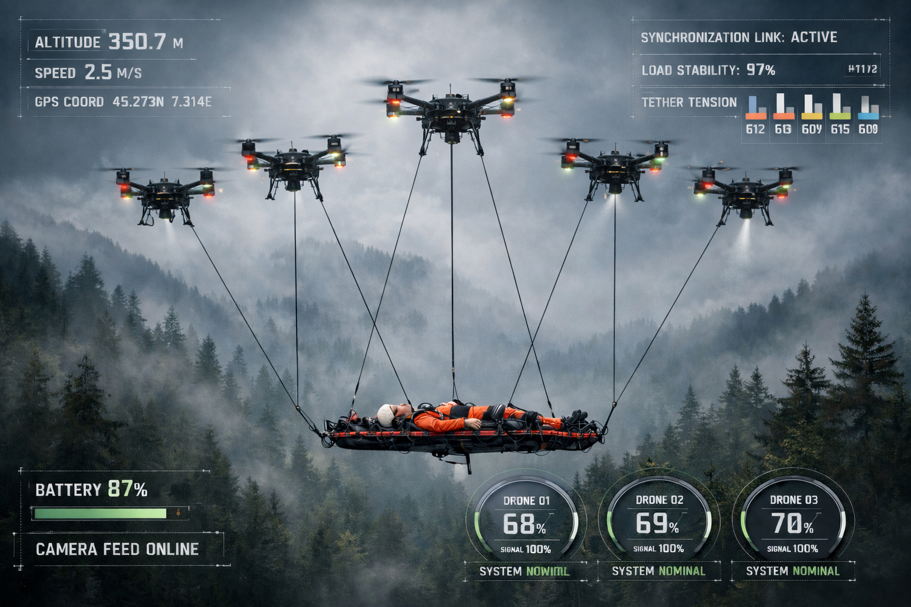

# DAS-SAR: Rozproszony Lotniczy System Poszukiwawczo-Ratowniczy (Rój)

🌍 **[English](README.md)** | 🇵🇱 **[Polski]** | 🇺🇦 **[Українська](README_UA.md)** | 🇮🇱 **[עברית](README_HE.md)**

[](https://docs.ros.org/en/humble/)
[](https://www.rust-lang.org/)
[](https://www.python.org/)
[](https://zenoh.io/)

## 📖 Przegląd

**DAS-SAR** (Distributed Aerial Search and Rescue) reprezentuje zmianę paradygmatu z tradycyjnej ewakuacji lotniczej obarczonej ryzykiem pojedynczego punktu awarii (np. śmigłowce) na **Fail-Operational Distributed Lift System (DLS)** — rozproszony system wynoszenia odporny na awarie. Zamiast polegać na jednej potężnej maszynie, wykorzystujemy rój autonomicznych dronów typu heavy-lift połączonych z jednym ładunkiem.

System ten został zaprojektowany nie tylko do poszukiwań i rozpoznania, ale do **nadmiarowego transportu ciężkich ładunków**. Dzięki oddzieleniu udźwigu od rozmiaru pojedynczego płatowca, rój DAS-SAR może ewakuować rannych (ładunki 100kg+) z obszarów niedostępnych dla konwencjonalnych statków powietrznych, takich jak gęste lasy, głębokie kaniony czy miejsce strefy katastrof.

---

## 📐 Wizualizacja Systemu



---

## 🚀 Kluczowe Funkcje

*   **Rozproszony Udźwig Odporny na Awarie:** Rój jest w stanie przetrwać całkowitą utratę jednego agenta w trakcie misji bez upuszczenia ładunku.
*   **Nadmiarowość 6 Agentów:** Faza 2 wykorzystuje minimum 6 dronów heavy-lift (koaksjalne oktokoptery). Zapewnia to niezbędną autorytet geometryczny do utrzymania kontroli 6-DOF (sześć stopni swobody) nawet w stanie awarii.
*   **Dynamiczna Wymiana Agentów:** Wspiera logikę "Hot-Swap", w której drony rezerwowe mogą zastąpić wyczerpane lub ulegające awarii jednostki w trakcie misji, zapewniając ciągłość operacji 24/7.
*   **Rozproszona Kontrola Admitancji:** Implementuje modele masa-sprężyna-tłumik w celu stabilizacji podwieszonego ładunku i zarządzania napięciem lin bez sztywnej walki o pozycję.
*   **Sieć Mesh (Zenoh):** Wykorzystuje **Eclipse Zenoh** do ultra-niskich opóźnień w koordynacji roju, znacznie przewyższając standardowy DDS w zatłoczonych lub rozległych środowiskach.

## 🏗 Struktura Projektu

```text
.
├── docker/                 # Konfiguracja Zenoh i ustawienia docker
├── docs/                   # Plany projektu, studia techniczne i analiza SORA
├── sar_swarm_ws/           # Obszar roboczy ROS 2
│   └── src/
│       ├── heavy_lift_core/# Główna logika dźwigu roju (Rust)
│       ├── px4_msgs/       # Definicje wiadomości PX4-ROS 2
│       ├── sar_perception/ # Węzły AI/Wizji (Detekcja i Lokalizacja - Python)
│       ├── sar_simulation/ # Symulacja roju i skrypty testowe
│       └── sar_swarm_control/ # Algorytmy rozproszonego sterowania (Rust)
├── Dockerfile              # Kontener środowiska programistycznego
├── docker-compose.yml      # Orkiestracja wielokontenerowa
├── README.md               # Ten plik
├── README_PL.md            # Dokumentacja w języku polskim
├── README_UA.md            # Dokumentacja w języku ukraińskim
├── README_HE.md            # Dokumentacja w języku hebrajskim
├── Business_Analysis.pdf   # Analiza biznesowa i rynkowa
├── ROADMAP.md              # Harmonogram projektu i kamienie milowe
├── TESTING.md              # Procedury i przewodniki testowe
└── AGENTS.md               # Kontekst techniczny i przewodnik programisty
```

## 🛠 Stos Technologiczny

| Komponent | Technologia |
| :--- | :--- |
| **Sterowanie Krytyczne dla Bezpieczeństwa** | **Rust** (rclrs, MAVSDK-Rust) |
| **AI i Wizja Komputerowa** | **Python** (PyTorch, YOLOv8/11) |
| **Middleware** | **Eclipse Zenoh** & **ROS 2** (Humble/Jazzy) |
| **Symulacja** | Gazebo Harmonic / PX4 SITL |
| **Sprzęt (Faza 1)** | NVIDIA Jetson Orin Nano, Pixhawk 6C, Holybro X500 V2 |
| **Sprzęt (Faza 2)** | T-Motor U15 II / Hobbywing X9 Plus (Koaksjalny X8) |

## 🚦 Rozpoczęcie Pracy

### Wymagania wstępne
- Docker & Docker Compose
- Ubuntu 22.04 LTS (zalecane)
- ROS 2 Humble/Jazzy
- Rust Toolchain

### Uruchamianie Symulacji
Projekt zawiera symulację opartą na Dockerze do testowania zachowania roju w języku Rust.

1. **Zbuduj środowisko Docker:**
   ```bash
   docker-compose build
   ```

2. **Uruchom symulację roju:**
   ```bash
   docker-compose up
   ```

3. **Wizualizacja na hoście:**
   ```bash
   python3 visualize_on_host.py
   ```

## 🧪 Programowanie

### Uruchamianie Testów Jednostkowych
Aby zweryfikować główną logikę sterowania:
```bash
cd sar_swarm_ws/src/sar_swarm_control
cargo test
```

## 📖 Dokumentacja

Dokumentacja projektu jest dostępna w wielu językach i formatach.

### 🎯 Case Biznesowy
*   **[Analiza Biznesowa (PDF)](Business_Analysis.pdf)** — Kompleksowa analiza rynku, propozycja wartości i ROI dla systemu DAS-SAR.

### Główna Dokumentacja
*   **[Plan Projektu](docs/Drone%20Swarm%20Evacuation%20Project%20Plan_PL.md)** ([EN](docs/Drone%20Swarm%20Evacuation%20Project%20Plan.md) / [UA](docs/Drone%20Swarm%20Evacuation%20Project%20Plan_UA.md)) — Strategia i specyfikacje Fazy 2.
*   **[Architektura Techniczna](docs/Technical%20Architecture_PL.md)** ([EN](docs/Technical%20Architecture.md) / [UA](docs/Technical%20Architecture_UA.md)) — Szczegółowe omówienie teorii sterowania i projektowania systemu.
*   **[Analiza Bezpieczeństwa SORA](docs/Safety_Case_SORA_PL.md)** ([EN](docs/Safety_Case_SORA.md) / [UA](docs/Safety_Case_SORA_UA.md)) — Analiza ryzyka dla ewakuacji ludzi.
*   **[Roadmap](ROADMAP.md)** — Harmonogram projektu i kamienie milowe.
*   **[Przewodnik po Testach](TESTING.md)** — Procedury walidacji zachowania roju.
*   **[Przewodnik Programisty](AGENTS.md)** — Kontekst techniczny dla deweloperów.

### Prace Techniczne (PDF)
*   [Drone Development Without Drones](docs/Drone%20Development%20Without%20Drones.pdf) (EN)
*   [Zaawansowane Środowiska Symulacyjne dla Autonomicznych Rojów Robotów](docs/Zaawansowane%20Środowiska%20Symulacyjne%20dla%20Autonomicznych%20Rojów%20Robotów.pdf) (PL)

## 👥 Autorzy i Kontakt

- **beret** - [beret@hipisi.org.pl](mailto:beret@hipisi.org.pl)
- **Marysia Software Limited** - [ceo@marysia.app](mailto:ceo@marysia.app)
- **Strona internetowa:** [https://marysia.app](https://marysia.app)

---

## ⚖️ Kwestie Prawne i Bezpieczeństwo
Operacje z wykorzystaniem rojów heavy-lift i transportu ludzi podlegają regulacjom EASA w kategoriach Specific/Certified. Wszystkie operacje muszą być zgodne z protokołami [SORA](docs/Safety_Case_SORA.md) zdefiniowanymi w dokumentacji.
